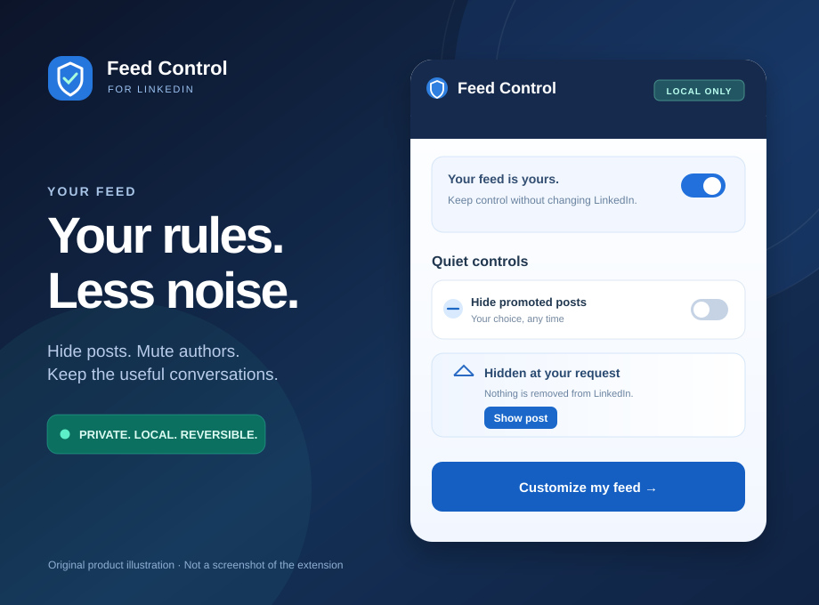
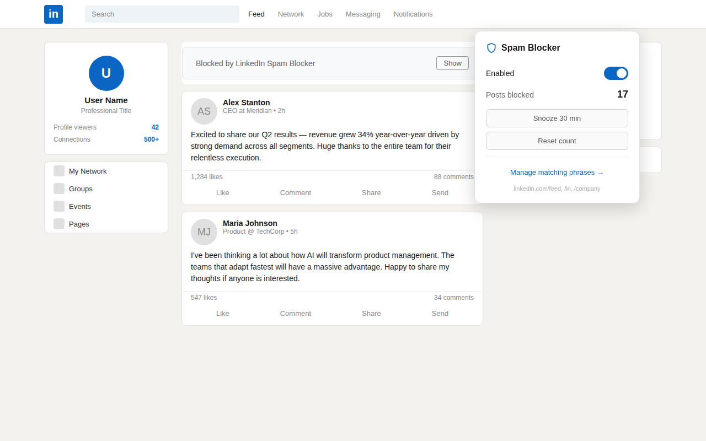
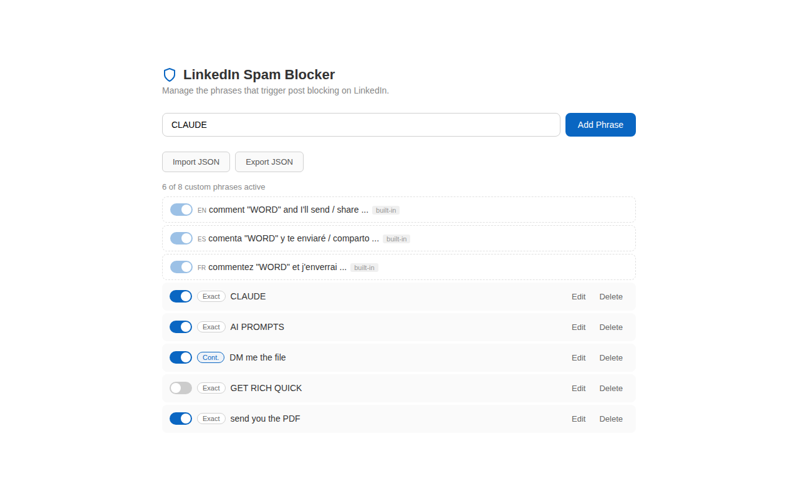
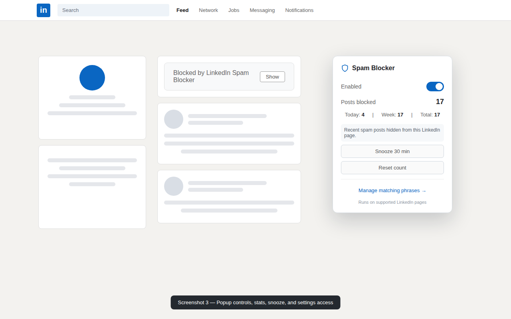

# LinkedIn Feed Control

**Make LinkedIn worth opening again.** Fewer distractions, more control, no trackers.

*The next evolution of LinkedIn Spam Blocker, part of the [Tooltician ecosystem](https://tooltician.com). The existing Chrome/Firefox listing names remain in place until a reviewed store release.*

**Read this in:** **English** | [Español](docs/README.es.md) | [Français](docs/README.fr.md) | [Português](docs/README.pt.md) | [Deutsch](docs/README.de.md)

LinkedIn can choose what to recommend. **You should get the final say about what stays on your screen.**

Feed Control lets you hide any post with one click, mute authors you no longer want in your feed, hide promoted posts, and keep the familiar engagement-bait blocking in five languages. Every hide is local and reversible. There is no account to create, no AI guesswork, no external API, and no data sent to the developer.

### What's new in the redesign

- **Hide any post.** A discreet control appears on recognized feed posts, not just posts already flagged as spam. Choose **Show** to restore it.
- **Mute an author in place.** Stop seeing recognized authors directly from ordinary feed posts. The existing author blocklist persists across sessions.
- **Make changes that actually take effect.** The popup offers an immediate promoted-post toggle. Switching the filter off reveals posts it hid, without undoing other hide reasons.
- **Make it yours.** Keep custom phrases, author allowlists, protected phrases, safe import/export, per-rule statistics, and multilingual detection.
- **Keep your privacy.** Everything operates within LinkedIn pages in your browser. No telemetry, tracking, remote blocklist, or new host permissions.

**What it deliberately doesn't promise:** We cannot change LinkedIn's recommendations server-side, recover posts LinkedIn never delivered, or reliably detect whether text was authored by AI. This is a selective local feed-control utility, not an alternative recommendation algorithm.

*Original promotional illustration. The functional screenshots below show the extension; this artwork does not claim to be a browser screenshot.*

## At a Glance

- **Private by design** — no analytics, telemetry, remote blocklists, AI APIs, or network requests of any kind
- **Multilingual** — built-in patterns for English, Spanish, French, Portuguese, and German, all toggleable
- **Under your control** — hide individual posts, mute authors, manage phrases, and import/export settings
- **Reversible** — show a hidden post temporarily or mark it as "Not spam" so the same text is never blocked again

## Why This Exists

LinkedIn's reporting flow often leaves engagement-bait posts untouched, even when they follow an obvious pattern: "comment X and I'll send you Y." Those posts are optimized for algorithmic reach, not useful discussion, and they can crowd out the work, hiring, and industry updates people actually opened LinkedIn to see.

This extension gives you a local, private way to make your own feed less noisy without waiting for platform enforcement. It does not report posts, contact LinkedIn, or change anything server-side. It only hides matching posts in your browser.

## How It Works

Feed Control examines text on supported LinkedIn pages against built-in engagement-bait patterns and the custom phrases you choose. It also adds one-click manual controls to recognized feed posts. When a post matches, it is hidden and replaced with a small placeholder so you can restore it immediately.

Detection is heuristic, not magic. It can miss new spam formats, and it can occasionally hide a post you wanted to see. The extension includes "Show", "Not spam", custom phrases, language toggles, and author whitelisting so you can tune it around your own feed.

## Features

**Privacy**
- Zero network requests — no analytics, telemetry, external APIs, or remote blocklists
- All data stays in browser storage; nothing is ever transmitted

**Detection**
- Built-in patterns for English, Spanish, French, Portuguese, and German, individually toggleable
- DOM text analysis instead of brittle LinkedIn CSS class names — survives feed layout changes better
- Incremental scanning catches newly loaded posts as you scroll
- Custom phrases with Exact or Contains matching

**Controls**
- **Hide this post** — manually hide an ordinary feed post without adding a permanent keyword rule or incrementing spam-detection counters
- **Mute this author** — persistently suppress a recognized author's feed posts from the post itself
- Undo any blocked post from the popup or the in-feed placeholder
- "Show all" from the popup to restore every hidden post for the session
- "Not spam" exclusion so the same text is never blocked again
- "Report missed spam" on any placeholder — copies the post text to your
  clipboard and opens a pre-filled GitHub issue (the report includes which
  pattern language matched; nothing is sent anywhere automatically).
  Right-clicking selected LinkedIn text offers the same "Report missed spam"
  action with identical clipboard + pre-filled-issue behavior (unmatched
  reports carry the "none" language marker)
- Optional toggles to hide "Promoted" posts in the feed and the "Featured" section on profiles (off by default; enable in settings)
- Author whitelist for profile, company, school, and showcase pages
- **Block this author** on any blocked post's placeholder — hides
  every post from that author feed-wide (also available from the
  profile-link right-click menu)
- Snooze for 30 minutes with automatic resume
- Right-click menus: selected text offers "Add to Feed Control" and "Report missed spam"; LinkedIn profile/company/school/showcase links offer "Block this author"
- Live settings — phrase and language changes apply without reloading
- Import / Export full settings as JSON — phrases, whitelist, author
  blocklist, disabled patterns, and the Promoted/Featured hide toggles

**Stats & coverage**
- Today, this week, and lifetime blocked counts in the popup
- Supported pages: feed, profiles, posts, company pages, school pages, showcase pages, groups, search, My Network, notifications, jobs, newsletters, and articles

## Limits

- LinkedIn can change its page structure, which may require detection updates.
- New engagement-bait wording can slip through until patterns or custom phrases catch up.
- False positives are possible, especially around posts that quote spam examples or discuss spam behavior.
- Counts are local convenience stats, not analytics-grade reporting.

## What It Does Not Do

- Does not report posts to LinkedIn or interact with LinkedIn servers in any way
- Does not affect what other people see — changes are local to your browser only
- Does not transmit your LinkedIn account data, browsing history, or post content. Explicitly saved author IDs and phrase preferences remain in browser storage.

## How To Use

For the fastest setup, install the extension and use LinkedIn normally. A discreet **Hide this post** and, when an author can be identified, **Mute this author** control is available on recognized feed posts. You don't need to configure patterns first.

1. Install the extension.
2. Open LinkedIn and scroll normally.
3. Matching engagement-bait posts are hidden automatically.
4. Click the extension icon to view stats, toggle blocking, snooze, or open settings.
5. Click "Show" on any blocked post to restore it temporarily.
6. Click "Not spam" if a post was incorrectly blocked.
7. Click "Block this author" on any blocked post to hide that author's posts feed-wide.
8. Add custom phrases from settings or by selecting text and choosing "Add to Feed Control" in the right-click menu when your feed invents a new flavor of bait.
9. Use the popup's **Hide promoted posts** checkbox to immediately toggle the filter.
10. Right-click selected LinkedIn text and choose "Report missed spam" to copy it and open a pre-filled issue when spam slips through.

## Install

### Chrome Web Store

[Install from the Chrome Web Store](https://chromewebstore.google.com/detail/linkedin-spam-blocker/eolknfnafdodmaaajdiidaanpjbfolfc)

### Firefox Add-ons

[Install from Firefox Add-ons](https://addons.mozilla.org/addon/linkedin-spam-blocker/)

### Latest Package

The latest packaged zip is attached to the [GitHub release](https://github.com/cortega26/stop-spam-linkedin/releases/latest). For local development or manual review, the unpacked install path below is usually easiest.

### Manual Unpacked Install

1. Clone the repo: `git clone https://github.com/cortega26/stop-spam-linkedin.git`
2. Open Chrome and go to `chrome://extensions`
3. Enable "Developer mode"
4. Click "Load unpacked" and select the `stop-spam-linkedin` folder
5. For Firefox, open `about:debugging#/runtime/this-firefox`, click "Load Temporary Add-on", and select `manifest.json`

## Screenshots

### Feed Blocking

### Settings

### Popup

## Development

No build step is required. The extension is vanilla JavaScript and Manifest V3.

Useful commands:

- `npm run smoke` — validates JSON and checks JavaScript syntax
- `npm run test:extension` — loads the unpacked extension in Chromium and verifies a mock LinkedIn spam post is hidden
- `npm run test:package` — packages the extension, then tests the exact zip for the current manifest version
- `npm run package` — creates `dist/linkedin-spam-blocker-{version}.zip` (version from manifest.json)

## Permissions

- `storage` — saves preferences, custom phrases, language settings, stats, snooze state, whitelist entries, and false-positive exclusion signatures in browser storage
- `contextMenus` — adds the right-click "Add to Feed Control" and "Report missed spam" actions for selected text and the "Block this author" action for LinkedIn profile/company/school/showcase links
- Static content-script matches on supported `https://www.linkedin.com/*` routes — scans LinkedIn pages without requesting a broader host permission

No data is ever transmitted. See [PRIVACY_POLICY.md](PRIVACY_POLICY.md).

## Support

Use the issue forms to keep reports structured:

- **Bug** — something broke or behaves unexpectedly
- **False positive** — a post was blocked that shouldn't have been
- **Missed pattern** — a spam post slipped through
- **Feature request** — something you'd like to see added

Include the relevant phrase or short excerpt and the LinkedIn page type. Avoid sharing private account details or full post content unless necessary to reproduce the issue.

## License

Source-available proprietary. You may inspect the source and use the extension for personal use, but redistribution, commercial reuse, and derivative competing products are not permitted without prior written permission. See [LICENSE](LICENSE).

---

Built and maintained by **Carlos Ortega** — automation, data systems, and web technical hygiene consulting. Portfolio and services: **[tooltician.com](https://tooltician.com/)**.

*Part of the [Tooltician](https://tooltician.com) ecosystem — privacy-first browser extension that cleans your LinkedIn feed.*
