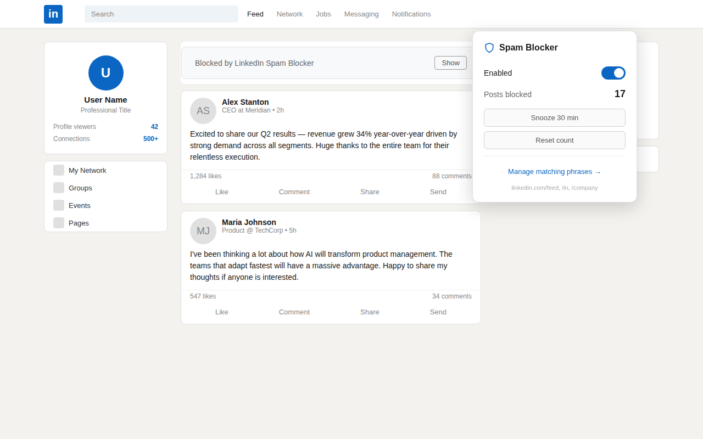
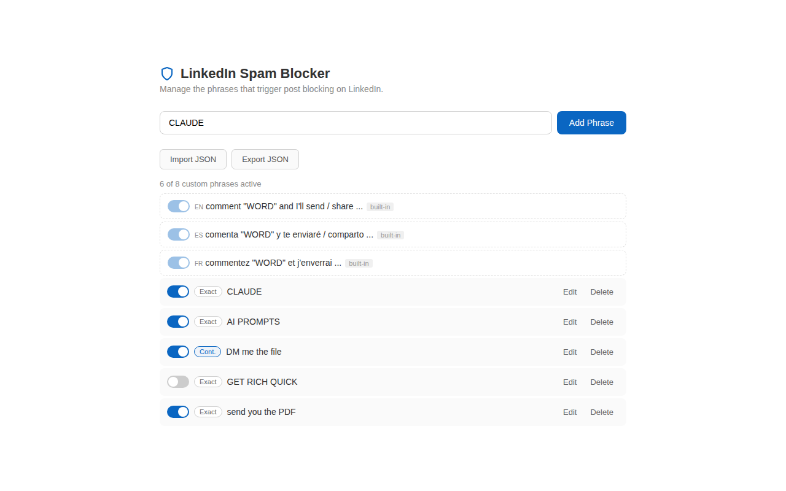
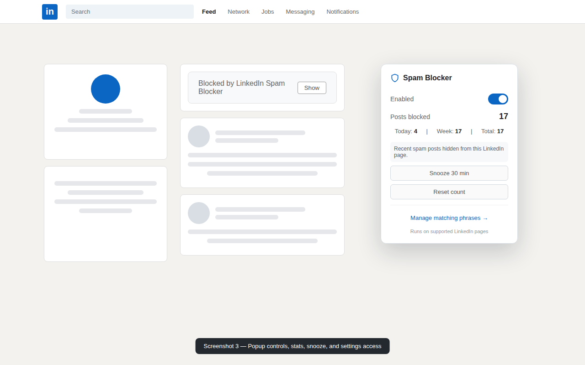

# LinkedIn Spam Blocker

**Lesen auf:** [English](../README.md) | [Español](README.es.md) | [Français](README.fr.md) | [Português](README.pt.md) | **Deutsch**

Diese "Kommentiere STRATEGIE und ich schicke dir das Framework"-Beitraege sind ueberall. LinkedIn Spam Blocker blendet sie automatisch aus — vollstaendig in Ihrem Browser, ohne dass etwas uebertragen wird.

Die Erweiterung erkennt Beitraege, die dazu auffordern, ein Stichwort wie "CLAUDE", "SKILL" oder "PROMPTS" zu kommentieren, um eine Datei, Vorlage, ein Prompt-Paket oder "Zugang" zu erhalten. Funktioniert in Chrome und Firefox, enthaelt Muster fuer fuenf Sprachen von Haus aus und erlaubt es, Blockierungen rueckgaengig zu machen oder anzupassen, wenn etwas falsch erkannt wird.

## Auf einen Blick

- **Privat by design** — keine Analytics, keine Telemetrie, keine Remote-Blocklisten, keine KI-APIs, keinerlei Netzwerkanfragen
- **Mehrsprachig** — integrierte Muster fuer Englisch, Spanisch, Franzoesisch, Portugiesisch und Deutsch, alle einzeln schaltbar
- **Anpassbar** — eigene Phrasen hinzufuegen, vertrauenswuerdige Autoren erlauben und Phrasen importieren/exportieren
- **Rueckgaengig machbar** — einen ausgeblendeten Beitrag voruebergehend anzeigen oder als "Not spam" markieren, damit derselbe Text nie wieder blockiert wird

## Warum es das gibt

LinkedIns Meldeprozess laesst Engagement-Bait-Beitraege oft online, selbst wenn sie einem offensichtlichen Muster folgen: "Kommentiere X und ich sende dir Y". Diese Beitraege sind auf algorithmische Reichweite optimiert, nicht auf nuetzliche Diskussionen, und sie koennen Arbeit, Jobs und Branchennachrichten verdraengen, fuer die Menschen LinkedIn eigentlich oeffnen.

Diese Erweiterung gibt Ihnen eine lokale und private Moeglichkeit, den eigenen Feed weniger laut zu machen, ohne auf Plattformdurchsetzung zu warten. Sie meldet keine Beitraege, kontaktiert LinkedIn nicht und aendert nichts serverseitig. Sie blendet nur passende Beitraege in Ihrem Browser aus.

## Funktionsweise

LinkedIn Spam Blocker analysiert Text auf unterstuetzten LinkedIn-Seiten und vergleicht ihn mit integrierten Engagement-Bait-Mustern sowie mit eigenen Phrasen, die Sie hinzufuegen. Wenn ein Beitrag passt, wird er ausgeblendet und durch einen kleinen Platzhalter ersetzt, ueber den er sofort wiederhergestellt werden kann.

Die Erkennung ist heuristisch, nicht magisch. Sie kann neue Spam-Formate verpassen und gelegentlich einen Beitrag ausblenden, den Sie sehen wollten. Die Erweiterung bietet "Show", "Not spam", eigene Phrasen, Sprachschalter und eine Autoren-Whitelist, damit Sie sie an Ihren Feed anpassen koennen.

## Funktionen

**Datenschutz**
- Keine Netzwerkanfragen — keine Analytics, keine Telemetrie, keine externen APIs, keine Remote-Blocklisten
- Alle Daten verbleiben im Browserspeicher; nichts wird jemals uebertragen

**Erkennung**
- Integrierte Muster fuer Englisch, Spanisch, Franzoesisch, Portugiesisch und Deutsch, einzeln schaltbar
- DOM-Textanalyse statt fragiler LinkedIn-CSS-Klassennamen — widerstandsfaehiger gegen Feed-Layout-Aenderungen
- Inkrementelle Analyse: prueft neue Beitraege beim Scrollen
- Eigene Phrasen mit Exact- oder Contains-Abgleich

**Steuerung**
- Jeden blockierten Beitrag im Popup oder ueber den Platzhalter im Feed rueckgaengig machen
- "Not spam"-Ausschluss, damit derselbe Text nie wieder blockiert wird
- Autoren-Whitelist fuer Profile, Unternehmen, Schulen und Showcase-Seiten
- 30-Minuten-Pause mit automatischer Wiederaufnahme
- Rechtsklick auf markierten Text, um eine Phrase sofort hinzuzufuegen
- Live-Einstellungen — Phrasen- und Sprachwechsel ohne Neuladen der Erweiterung
- Import / Export der Phrasenliste als JSON

**Statistiken und Abdeckung**
- Zaehler fuer heute, diese Woche und insgesamt im Popup
- Unterstuetzte Seiten: Feed, Profile, Beitraege, Unternehmensseiten, Gruppen, Suche, Mein Netzwerk, Benachrichtigungen, Jobs, Newsletter und Artikel

## Grenzen

- LinkedIn kann die Seitenstruktur aendern, wodurch Erkennungsupdates noetig werden koennen.
- Neue Engagement-Bait-Formulierungen koennen durchrutschen, bis Muster oder eigene Phrasen angepasst sind.
- False Positives sind moeglich, besonders bei Beitraegen, die Spam-Beispiele zitieren oder Spam-Verhalten diskutieren.
- Zaehler sind lokale Komfortstatistiken, keine praezisen Analytics-Berichte.

## Was die Erweiterung nicht tut

- Meldet keine Beitraege an LinkedIn und interagiert auf keine Weise mit LinkedIn-Servern
- Beeinflusst nicht, was andere sehen — Aenderungen sind ausschliesslich lokal in Ihrem Browser
- Liest, speichert oder uebertraegt keine LinkedIn-Kontodaten, keinen Browserverlauf und keine Beitragsinhalte

## Nutzung

1. Installieren Sie die Erweiterung.
2. Oeffnen Sie LinkedIn und scrollen Sie normal.
3. Passende Engagement-Bait-Beitraege werden automatisch ausgeblendet.
4. Klicken Sie auf das Erweiterungssymbol, um Statistiken zu sehen, zu aktivieren/deaktivieren, zu pausieren oder Einstellungen zu oeffnen.
5. Klicken Sie bei einem blockierten Beitrag auf "Show", um ihn voruebergehend wiederherzustellen.
6. Klicken Sie auf "Not spam", wenn ein Beitrag faelschlich blockiert wurde.
7. Fuegen Sie eigene Phrasen in den Einstellungen hinzu oder markieren Sie Text und verwenden Sie das Kontextmenue, wenn Ihr Feed eine neue Bait-Variante erfindet.

## Installation

### Chrome Web Store

Veroeffentlichung ausstehend. Nutzen Sie vorerst die manuelle Installation unten.

### Firefox Add-ons

Veroeffentlichung ausstehend. Nutzen Sie vorerst die temporaere Add-on-Installation unten.

### Aktuelles Paket

Die aktuelle Zip-Datei ist an die [neueste GitHub-Release](https://github.com/cortega26/stop-spam-linkedin/releases/latest) angehaengt. Fuer lokale Entwicklung oder manuelle Pruefung ist die ungepackte Installation meist am einfachsten.

### Manuelle ungepackte Installation

1. Repository klonen: `git clone https://github.com/cortega26/stop-spam-linkedin.git`
2. Chrome oeffnen und `chrome://extensions` aufrufen
3. "Entwicklermodus" aktivieren
4. Auf "Load unpacked" klicken und den Ordner `stop-spam-linkedin` auswaehlen
5. In Firefox `about:debugging#/runtime/this-firefox` oeffnen, auf "Load Temporary Add-on" klicken und `manifest.json` auswaehlen

## Screenshots

### Blockierung im Feed

### Einstellungen

### Popup

## Entwicklung

Es ist kein Build-Schritt erforderlich. Die Erweiterung nutzt Vanilla JavaScript und Manifest V3.

Nuetzliche Befehle:

- `npm run smoke` — validiert JSON und prueft JavaScript-Syntax
- `npm run test:extension` — laedt die ungepackte Erweiterung in Chromium und prueft, ob ein simulierter LinkedIn-Spam-Beitrag ausgeblendet wird
- `npm run test:package` — paketiert die Erweiterung und testet die genaue Zip-Datei der aktuellen Manifest-Version
- `npm run package` — erstellt `dist/linkedin-spam-blocker-{version}.zip` anhand der Version in `manifest.json`

## Berechtigungen

- `storage` — speichert Einstellungen, eigene Phrasen, Sprachen, Statistiken, Pausenzustand, Whitelist-Eintraege und False-Positive-Signaturen im Browserspeicher
- `contextMenus` — fuegt die Rechtsklick-Aktion "Add to LinkedIn Spam Blocker" fuer markierten Text hinzu
- Statische Content-Script-Matches auf unterstuetzten `https://www.linkedin.com/*`-Routen — analysiert LinkedIn-Seiten ohne breitere Host-Berechtigung

Es werden keine Daten uebertragen. Siehe [PRIVACY_POLICY.md](../PRIVACY_POLICY.md).

## Support

Verwenden Sie die Issue-Formulare, um Berichte strukturiert einzureichen:

- **Bug** — etwas funktioniert nicht mehr oder verhaelt sich unerwartet
- **Falsches Positiv** — ein Beitrag wurde blockiert, obwohl er es nicht sollte
- **Verpasstes Muster** — ein Spam-Beitrag wurde nicht erkannt
- **Funktionswunsch** — etwas, das Sie gerne hinzugefuegt saehen

Geben Sie die relevante Phrase oder einen kurzen Auszug und den LinkedIn-Seitentyp an. Bitte teilen Sie keine privaten Kontodaten oder vollstaendigen Beitragsinhalte, sofern sie nicht zur Reproduktion noetig sind.

## Lizenz

Source-available proprietaer. Sie duerfen den Quellcode einsehen und die Erweiterung privat nutzen, aber Weiterverteilung, kommerzielle Nutzung und konkurrierende abgeleitete Produkte sind ohne vorherige schriftliche Genehmigung nicht erlaubt. Siehe [LICENSE](../LICENSE).

